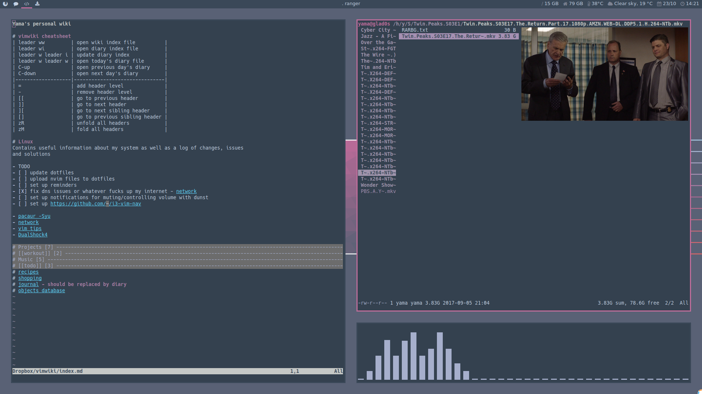
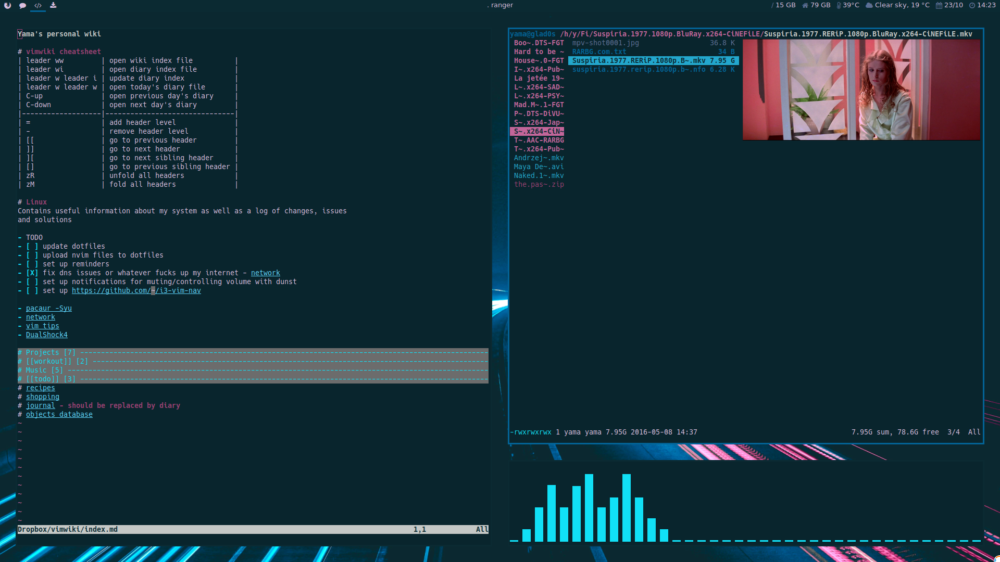
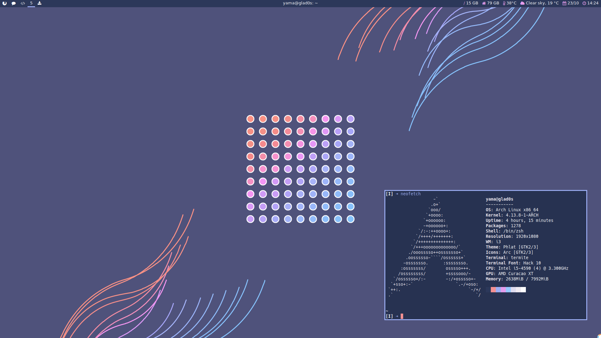
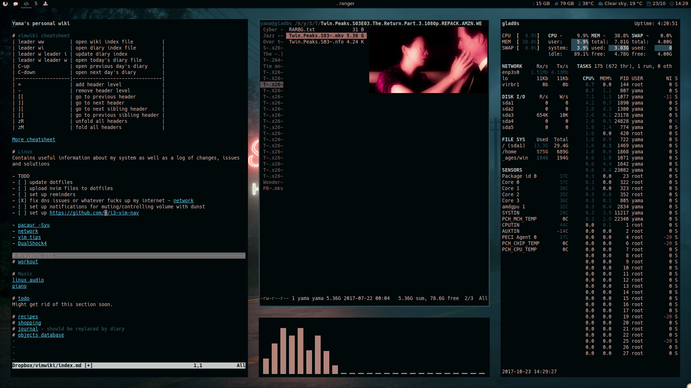
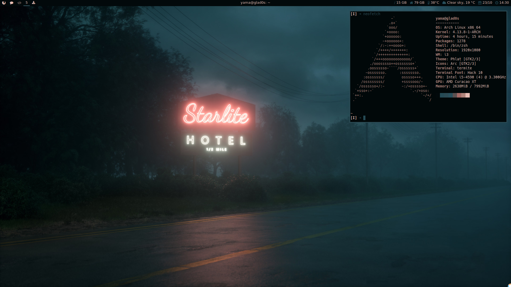

# Dotfiles

Config files for my current setup on Arch Linux with i3-gaps

## Screenshots

## Programs

- [i3-gaps](https://github.com/Airblader/i3)
- [ranger](https://github.com/ranger/ranger)
- [rofi](https://davedavenport.github.io/rofi/)
- [polybar](https://davedavenport.github.io/rofi/)
- [weechat](https://weechat.org/)
- [pywal](https://github.com/dylanaraps/pywal)
- [mpv](https://mpv.io/)
- [zsh](http://www.zsh.org/)
- [dunst](https://github.com/dunst-project/dunst)
- [neovim](https://neovim.io/)  
- [termite](https://github.com/thestinger/termite/)
- [streamlink](https://github.com/streamlink/streamlink)
- [qutebrowser](https://qutebrowser.org/)
- scripts - several custom scripts

## TODO

- global mpv keybinds
- dual monitor setup
- easier way to open a ff window with twitch chat alongside mpv
- figure out a better way for containers a and b
